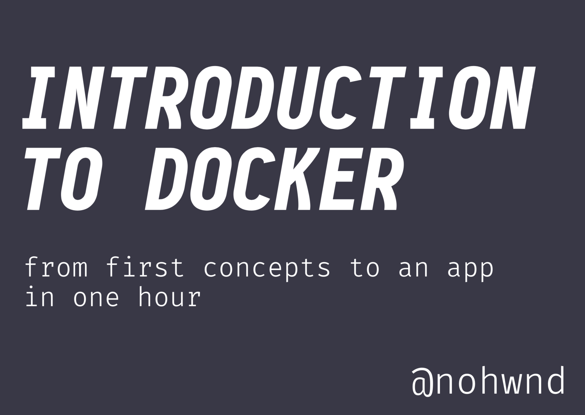

# 🐳 Introduction to Docker 

Sources for presentation from _16. 04. 2019_ presented at .NET Meetup Prague. 

## License

The content of this project itself is licensed under the Creative Commons Attribution 3.0 Unported license, and the underlying source code is licensed under the MIT license.